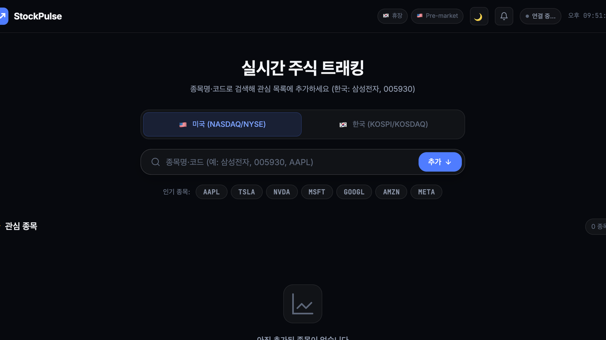
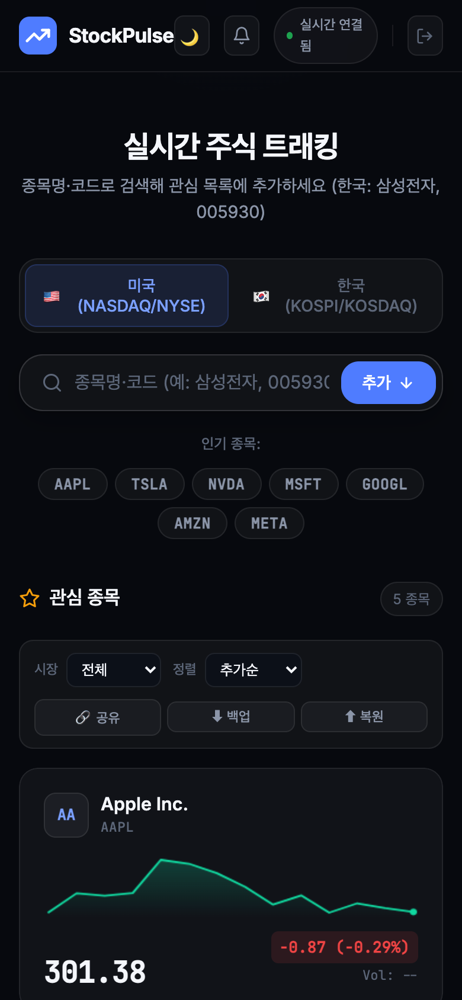

# StockPulse

> 미국 · 한국 주식을 한 화면에서 실시간으로 추적하는 웹 앱

<table>
  <tr>
    <td></td>
    <td></td>
  </tr>
  <tr>
    <td align="center">Desktop</td>
    <td align="center">Mobile</td>
  </tr>
</table>

**🌐 Live:** https://stock-tracker-opal-six.vercel.app

---

## 기능

- **실시간 시세** — US WebSocket 실시간 / KR 3~60초 폴링
- **한국주식 한글 검색** — `삼성전자`, `005930` 등 한글명·코드 직접 입력
- **차트** — 라인·캔들, 1일~5년 범위
- **포트폴리오** — US·KR 통합 원화 손익 (실시간 환율)
- **가격 알림** — 목표가·등락률 조건 달성 시 브라우저 알림
- **관심목록 동기화** — 로그인 시 PostgreSQL DB에 서버 저장
- **인증** — 로그인 코드 입력 방식, HMAC 쿠키 세션
- **PWA** — 홈 화면 설치, 오프라인 캐시, URL 공유

---

## 기술 스택

| | |
|---|---|
| **Frontend** | Vanilla JS · CSS Variables · PWA (Service Worker) |
| **Backend** | Node.js 18 · Express · WebSocket |
| **Database** | PostgreSQL 16 (Railway Postgres / 로컬 Docker) |
| **시세** | Finnhub WebSocket + REST · Yahoo Finance (KR) |
| **배포** | Vercel (프론트) · Railway (API + DB + WebSocket) |

---

## 로컬 실행

```bash
npm run install:all
cp backend/.env.example backend/.env   # FINNHUB_API_KEY 등 입력

npm run db:up        # Docker PostgreSQL 시작 (포트 5433)
npm run db:migrate   # 테이블 생성
npm run db:gen-code  # 로그인 코드 발급

npm start            # → http://localhost:3000
```

---

## 환경 변수 (`backend/.env`)

| 변수 | 설명 |
|------|------|
| `FINNHUB_API_KEY` | [finnhub.io](https://finnhub.io) 무료 키 |
| `SESSION_SECRET` | 세션 쿠키 서명 키 |
| `ADMIN_SECRET` | 관리자 API 키 |
| `DATABASE_URL` | PostgreSQL 연결 URL |
| `AUTH_CODE` | DB 없을 때 fallback 로그인 코드 |

---

## 구조

```
stock-tracker/
├── frontend/          # Vercel 정적 배포
│   ├── app.js         # 클라이언트 전체 로직
│   ├── style.css      # Minimal + Glass 디자인
│   └── login.html     # 로그인 코드 입력
├── backend/
│   ├── server.js      # Express API + WebSocket 프록시
│   ├── migrations/    # PostgreSQL 스키마
│   └── gen-code.js    # 로그인 코드 생성 CLI
├── Dockerfile         # Railway 배포 (build context: backend/)
└── vercel.json        # /api/* → Railway rewrite
```

---

## 주요 명령

```bash
npm start                              # 로컬 서버
npm run db:gen-code                    # 로그인 코드 생성
npm run db:gen-code -- --code MY-CODE  # 커스텀 코드 지정
npm run qa                             # 자동 QA (로컬)
npm run qa:prod                        # 자동 QA (프로덕션)
npx vercel deploy --prod               # Vercel 배포
```

---

<details>
<summary>📄 문서</summary>

| 파일 | 내용 |
|------|------|
| [docs/HANDOFF.md](./docs/HANDOFF.md) | 마스터 — 구조·API·현황·의사결정 |
| [docs/TASKS.md](./docs/TASKS.md) | 작업 트래킹 |
| [docs/DEPLOY.md](./docs/DEPLOY.md) | Vercel · Railway 배포 가이드 |
| [docs/AUTH.md](./docs/AUTH.md) | 인증 구조 |
| [docs/QA.md](./docs/QA.md) | QA 체크리스트 |

</details>
